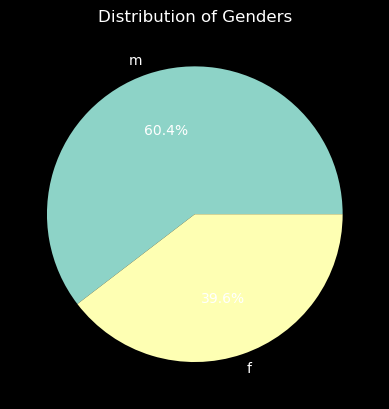
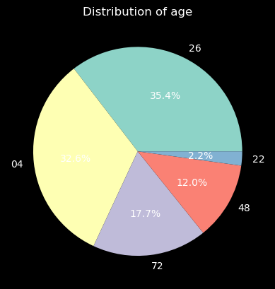

# Decoding Infant Cries: An Investigation using the Donate-a-cry Corpus

- *Author:* Manideep Akam
- *Term:* Summer 2023
- *PPT:* (https://github.com/manideep2009mar/manideep_data606/blob/main/docs/capstone.pptx)
- *Youtube:* (link)
- *GitHub:* (https://github.com/manideep2009mar/manideep_data606.git)

## Background

Infants cannot communicate verbally until certain age. They express their distress through cry and experts such as Babysitters, nannies and childcare providers can easily understand the signal start acting accordingly which is not so easy for new parents. Babysitters, nannies, childcare providers can understand the pattern, developing a Machine learning models that can identify the reason for cry could help new parents and care givers in enhancing infant wellness. This model can be part of baby monitors.

Accurately identifying and interpreting the different types of infant cries poses a significant challenge, hindering timely and appropriate responses to infant distress. The lack of comprehensive understanding and systematic analysis of cry patterns, coupled with the influence of contextual factors like age and health status, restricts our ability to effectively address infant needs. There is a need for robust methodologies and insights to classify cries and uncover correlations with contextual factors, enabling improved recognition and response to infant distress.

## Data sources 
DonateaCry Corpus, a valuable resource consisting of audio recordings of infant cries collected from infants with diverse health conditions. The dataset offers a rich and comprehensive collection of cry sounds, encompassing different types of distress, such as hunger cries, pain cries, and discomfort cries. It serves as an invaluable tool for investigating the characteristics, patterns, and potential indicators of infant distress.
Link: (https://github.com/gveres/donateacry-corpus/)

## Data elements

Dataset has just audio files and their metadata incorported in their filenames. Librosa library is used to load the audio recordings and extract relevant features from the cry signals.

| Name | Description |
| ----------- | ----------- |
| filename | Name of the file |
| gender | gender of the baby |
| age   | Age group of the baby |
| label | Reason for cry |
| duration | Length of the recording in seconds |
| features | Melspectrogram of the audio |

## Results of EDA 

- Dataset has 457 recordings
- Duration around 7 seconds 
- No null values
- No discrepencies found on gender, age, label columns
-  
- 
- 
- 
- 
- 2D image representation of a baby cry 

## Results of ML (training, evaluation, deployment, etc.), 

| Model | Training | Evaluation |
| ----------- | ----------- | ----------- |
| Simple CNN | 94.79| 77.17 |
| CNN with multiple convolution layers | 96.99 | 70.65 |
| CNN with Dropout Regularization | 93.97 | 77.17 |
| CNN with Learning Rate Scheduler | 90.96 | 76.08 |
| CNN with class_weight | 94.79 | 72.82 |
| One vs Remaining | 96.71 | 77.17 |

CNN model with Dropout Regularization has less evaluation than other models. It is deployed locally on streamlit and tested successfully.

## Conclusion 

Models have done decent job with available limited data, can perform better with training on more data. 

## Future research direction

- Create another model similar to baby monitors to detect the cry and trim the needed portion and feed it to the existing model
- Extract data from other sources such as Environmental sounds dataset that also consists infants cry
- Try Machine learning algorithms and pretrained models